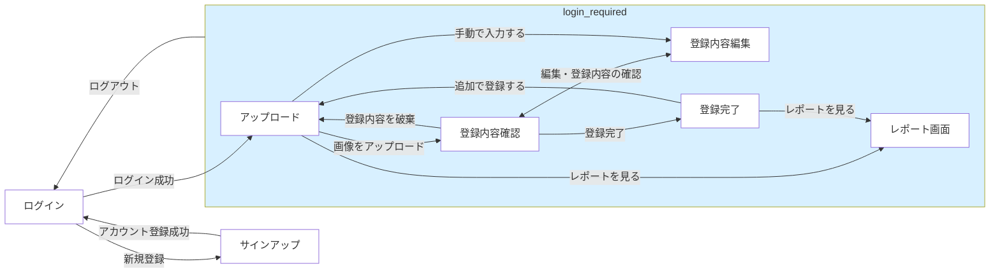
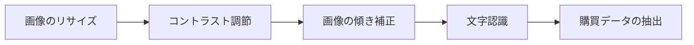
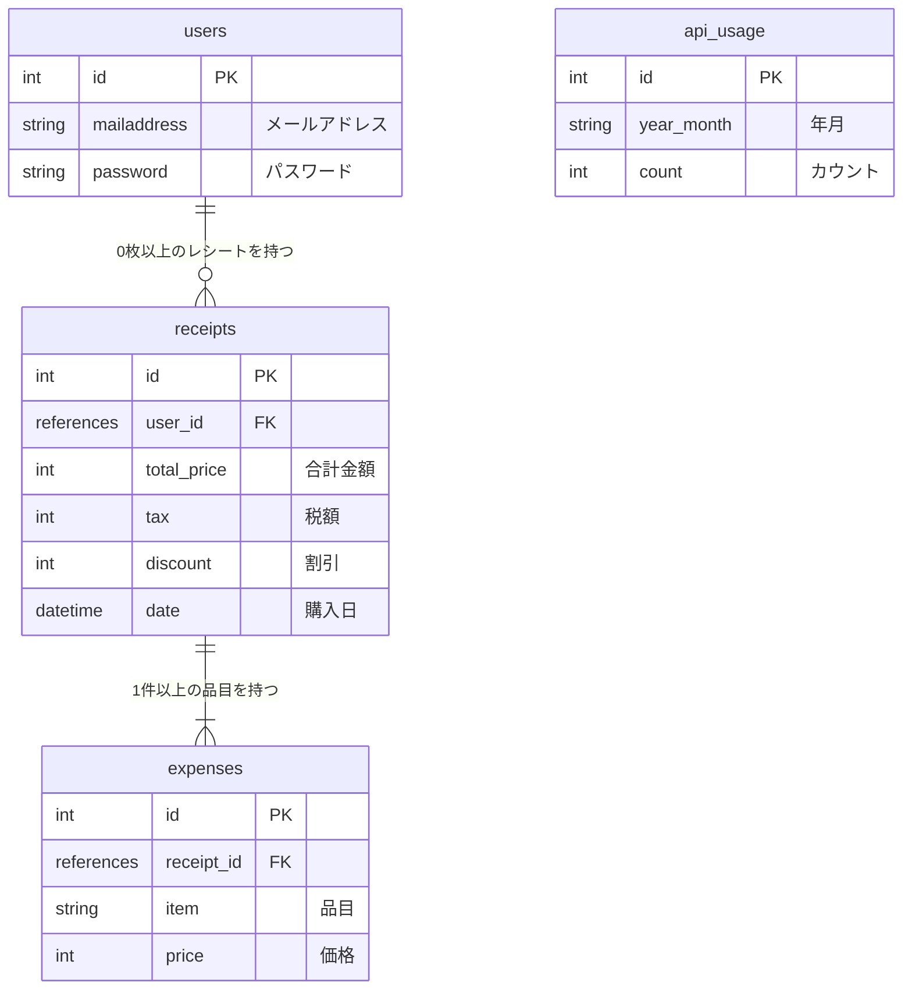

# RECEIPT CAPTURE

画像アップロードによる自動文字認識（OCR）機能を備えたレシート管理・家計簿Webアプリケーションです。  
紙のレシートから購買データを自動抽出し、月ごとの支出レポートの確認をスムーズに行うことができます。

**Web UI App:**
https://receiptcapture.onrender.com

<br>

## 開発背景

現在の業務において、紙面のアンケート結果などをExcelへ転記する、といった業務があります。これを手作業で行うのは時間的にも精神的にも負担がかかるのでどうにかしてツールを使って自動化できないか、と考えている内に光学文字認識（OCR）に興味がわいてきました。  
そこで実際の業務を想定して、「紙面から文字を取得し、目的の文字列を正確に抽出して指定のフォーマットに整形する」というプロセスの実現を目指し、本アプリを開発しました。

<br>

## 主な機能

実運用を想定し、以下の２点を重視した設計を行いました。

**1. 不特定多数のユーザーが使用しても問題のない信頼性の高い設計**  
サーバーとフロント間の通信には CSRF token を付与してセキュリティを向上しています。
エンドポイントの切り替え時にはセッションによるフラグ制御を行い、想定していない画面遷移（ユーザーがURLを直接入力して飛ぼうとするなど）が発生しないようアクセスを制限しています。

**2. 文字の自動認識と手動入力を両立した柔軟性の高いUI**  
データ入力機能では、文字認識による自動化と手動入力を柔軟に取り入れることで、文字認識が正常に機能しなかった場合でもユーザーがストレスなく使えるよう、ユーザビリティに配慮した設計にしました。

<br>

### 画面遷移図

<br>



<br>

### 各画面の機能


#### ログイン
メールアドレスとパスワードを入力することでログインできます。入力内容はFlaskのForm機能でバリデーションチェックを行います。  
ログイン状態でアクセスしようとすると後述のアップロード画面へリダイレクトします。

#### サインアップ
アカウント登録画面。  
既に登録されたユーザーとメールアドレスが重複しておらず、かつバリデーションに反していなければサインアップできます。

#### アップロード
画像をアップロードできる画面。ログインに成功するとこのページに遷移します。  
自動文字認識ではレシートのフォーマットによっては文字の抽出が上手くいかない場合もあるため、その場合の迂回策として「手動で入力する」から直接データを入力できるようにしています。

#### 登録内容確認
アップロードした画像の読み取り結果を確認できます。  
読み取り結果に問題が無い場合はDBへの登録、内容を編集したい場合は編集画面へ遷移できます。  
読み取り結果を破棄してアップロード画面へ戻ることもできます。

#### 登録内容編集
読み取り結果の編集ができます。  
登録ボタンから「登録内容確認」画面へ移行できるほか、編集内容を取り消して元の読み取り結果に戻すこともできます。

レシート上の価格表記が税抜きである場合でも、プルダウンで税率を選択することで税率を適用できます。
税金の計算方法はラジオボタンから以下の2通りを選択することができます。  

* **税率ごとの小計に税率を適用（合計方式）：**
税抜きの金額の合計に税率を乗算する、一般的な方式

* **各品目ごとに税率を適用（個別方式）：**
各品目の価格に税率を乗算する

<br>

## 機能の詳細

### 光学文字認識（OCR）
アップロードされた画像に対して、テキストの抽出までに以下のような処理を行っています。

<br>



<br>

画像内のテキストが傾いている場合、レシート上の商品と金額のペアを特定するのが難しくなるため、前処理で傾きを補正する必要があります。
傾き補正の工程では、 Python 外部ライブラリの OnnxOCR で文字が存在する領域のみを検出しており、この工程で補正された画像をもう一度、今度は Vision API で文字認識をすることで後工程の正規表現を用いたデータの抽出を行えるようにしています。

傾き補正と文字認識工程で使用するAPIを分けている理由として、文字認識の精度は Vision API のほうが高いのですが、リクエスト数による従量課金が発生するため、運用費を抑えるという視点で前工程では無料で使える OnnxOCR を採用したという経緯があります。  
ただ、クラウド環境へのデプロイ時に OnnxOCR はモデル読み込みでサーバーのメモリ消費を圧迫することが判明し、【サーバーの利用料 > Vision API のトークン使用料】 となってしまうため、結果的には前処理でも Vision API を使ったほうが良かったです。

<br>

## 使用技術
- **バックエンド：** Python3.11.9/Flask
- **データベース：** PostgreSQL (Production) / SQLite (Development)
- **ORM / Migration：** Flask-SQLAlchemy / Flask-Migrate
- **画像処理 / OCR：** OpenCV / OnnxOCR / Google Cloud Vision API
- **サーバー：** Gunicorn
- **デプロイ：** Render

<br>

## ローカル環境での起動方法

#### 1. リポジトリのクローンと依存関係のインストール

```Bash
git clone [https://github.com/your-account/receipt-capture.git](https://github.com/your-account/receipt-capture.git)
cd receipt-capture
python -m venv venv
source venv/bin/activate  # Windows: venv\Scripts\activate
pip install -r requirements.txt
```

#### 2. 環境変数の設定
.env ファイルをルートディレクトに作成し、必要な設定を記述します。

```
FLASK_APP=app.main
FLASK_ENV=development
SECRET_KEY=your-secret-key
WTF_CSRF_SECRET_KEY=your-secret-key
DATABASE_URL=sqlite:///app.db
GOOGLE_CREDENTIALS_JSON={"type": "service_account", ...} # GCP サービスアカウントJSON
```

#### 3. データベースマイグレーションと起動

```Bash
flask db upgrade
flask run
```

<br>

## データベース設計

※ api_usage は、 Vision API の無料利用枠を超過しないようにするため、アプリ全体での利用回数を記録しています。

